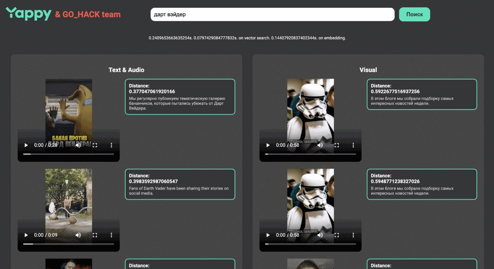

# Сервис текстового поиска по медиаконтенту Yappy
Пример реализации текстового поиска по медиаконтенту в рамках [ЛЦТ2024](https://i.moscow/lct), [задача 15](https://i.moscow/lct/hackatons/48e544293d8648b987bd00f1406efdb3/ru/).

* [REST API](#rest-api-/-usage)
* [Description](#apply)
* [Project structure](#Project-structure)
* [Installation](#Installation)
* [Roadmap](#Roadmap)
* [Authors](#Authors)


## REST API / Usage
<b> Сервис не всегда онлайн. Перед тестированием просьба связаться через организаторов, для поднятия сервиса. Заранее спасибо.</b>
<b>  </b>


### Поиск видео по текстовому запросу

GET http://176.123.161.67/api/search

<b>Python3</b>
```python
import requests
payload = {'query': 'dogs'}
response = requests.get('http://176.123.161.67/api/search', params=payload)
```

<b>Bash</b>
```bash
curl "http://176.123.161.67/api/search?query=dogs"
```

### Индексация видео

POST http://176.123.161.67/api/index

<b>Python3</b>
```python
import requests
payload = {'link': url, 'description': description}
response = requests.post('http://176.123.161.67/api/index', json=payload)
```

<b>Bash</b>
```bash
curl --header "Content-Type: application/json" \
  --request POST \
  --data '{"link":"url","description":"description"}' \
  "http://176.123.161.67/api/index"
```

### Статус индексации

GET http://176.123.161.67/workers

## Description

### Описание задачи и доступные вводные
В библиотеке Yappy десятки миллионов коротких видео. Возможность быстро и эффективно находить интересующий контент улучшает пользовательский опыт, помогает найти новые интересы пользователя и улучшить рекомендации.

Задача заключается в разработке сервиса, который позволяет индексировать и осуществлять поиск по видео на основе медиаконтента. Сервис должен уметь обрабатывать запросы пользователей, извлекать из них ключевые слова и на их основе осуществлять поиск релевантных видеофайлов. 

Input:
  - Набор видеофрагментов. Около 400к видео с описанием.

Ouput:
  - ML алгоритм позволяющий индексировать и осуществлять поиск по медиаконтенту.
  - Backend часть, позволяющая ускорить, дополнить и сделать алгоритм доступным.

### Как мы решали эту задачу
Для разработки сервиса качественного и быстрого поиска по видео мы выбрали комплексный подход с аналитикой и сравнениями.
Подход заключается в оценке звука, визуала, текста визуала и описания видео. Под каждую характеристику видео выбирался свой инструмент, который открытый, достаточно быстрый, выдает качественные результаты, имеет открытую лицензию и возможность ускорения через GPU.
Помимо оценки видео, перевода его в вектор, необходим быстрый поиск. Для этого мы выбрали векторную базу данных.

Более подробное описание нашего решения можно найти в [документации и презентации проекта](/Документация).

## Project structure

```
.
.
├── Dockerfile                 # Конфигурация для контейнера Docker
├── README.md                  # Описание проекта
├── app.py                     # Основной файл приложения
├── backend.py                 # Логика backend части приложения
├── docker-compose.yml         # Конфигурация для Docker Compose
├── models_loader.py           # Загрузка и инициализация моделей
├── requirements.txt           # Список зависимостей
├── setup.py                   # Настройки проекта
├── test.py                    # Тесты для функционала
├── text_summary.py            # Скрипт для суммаризации текста
├── conf                       # Конфигурации для Celery, Nginx, Flower
├── core                       # Основная логика проекта
│   ├── ocr                    # Модуль для распознавания текста на кадрах
│   ├── text_cleanup           # Модуль для суммаризации текста
├── junk                       # Вспомогательные файлы, наработки
├── storage                    # Модуль для работы с векторной базой данных
├── tasks                      # Логика обработчиков запросов, обработка ruCLIP
├── upload_video               # Пример индексации видео
└── Документация               # Документация и презентации проекта

```
## Installation

```bash
docker compose up
```

## Roadmap

Смотреть предложения по доработке в [документации и презентации проекта](/Документация).

## Authors

* Александр Валясин [tg](https://t.me/alexander_zxcc) - Data Engineer, Data Scientist
* Кирилл Богатырёв [tg](https://t.me/fizzzgen) - Backend developer
* Богдан Онищенко [tg](https://t.me/yourbg000) - Data Scientist
* Никита Молчанов [tg](https://t.me/lusm554) - Data Scientist
* Денис Самаркин [tg](https://t.me/DenisSamarkin) - Data Engineer, Data Scientist

